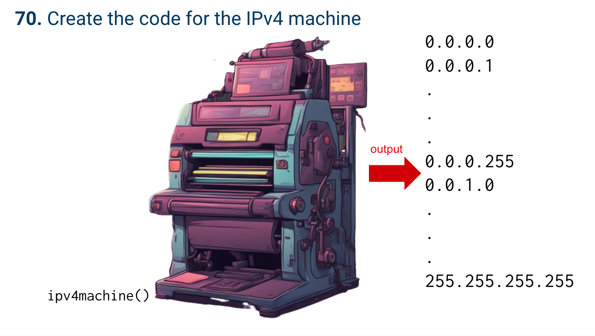

# Quiz 70

## Problem


## Paper work


## Code
```.py

a,b,c,d = 0, 0, 0, 0

while a < 266:
    while b < 266:
        while c < 266:
            while d < 266:
                d += 1
                print(a, b, c, d)
            d = 0
            c += 1
            print(a, b, c, d)
        c = 0
        b += 1
        print(a, b, c, d)
    b = 0
    a += 1
    print(a, b, c, d)

```

## Result

