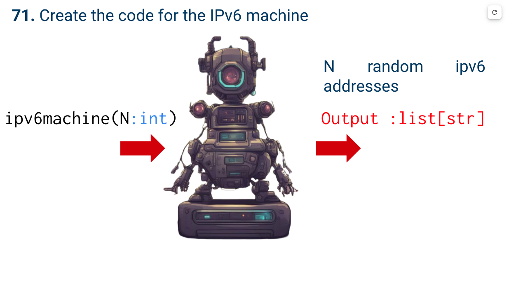
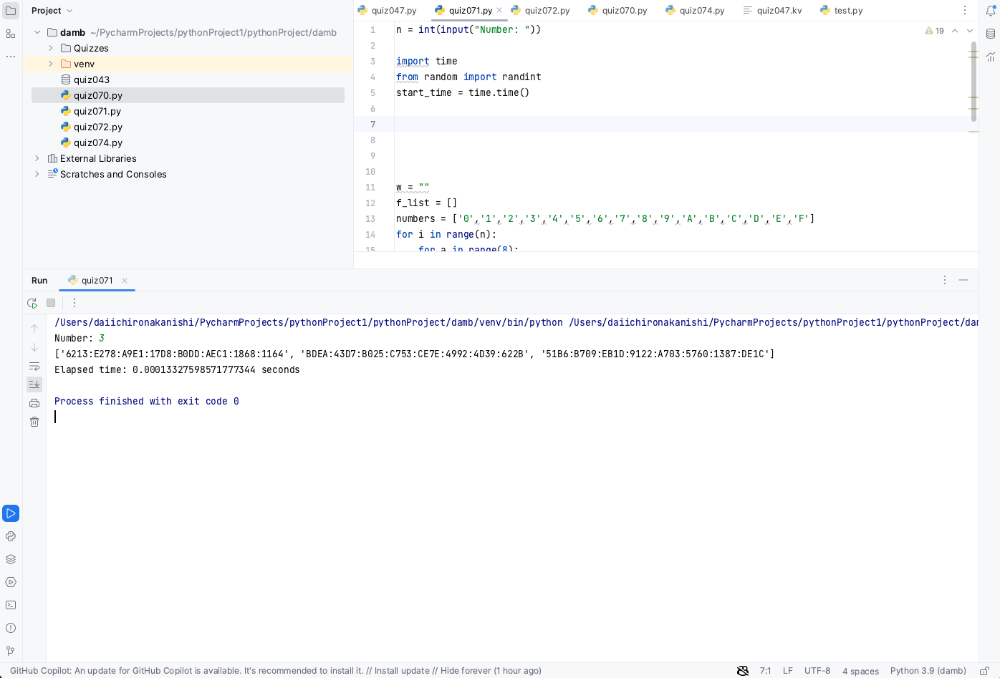

# Quiz 71

## Problem


## Paper work


## Code
```.py
n = int(input("Number: "))

import time
from random import randint
start_time = time.time()


w = ""
f_list = []
numbers = ['0','1','2','3','4','5','6','7','8','9','A','B','C','D','E','F']
for i in range(n):
    for a in range(8):
        for x in range(4):
            z = randint(0,14)
            f_z = numbers[z]
            w += f_z
        if not a == 7:
            w += ":"
    f_list.append(w)
    w = ""


print(f_list)


end_time = time.time()
elapsed_time = end_time - start_time
print(f"Elapsed time: {elapsed_time} seconds")

```
## Additional Information
I used the function called "time" to record how long the process takes.
The result of it is printed under the main result.


## Result


