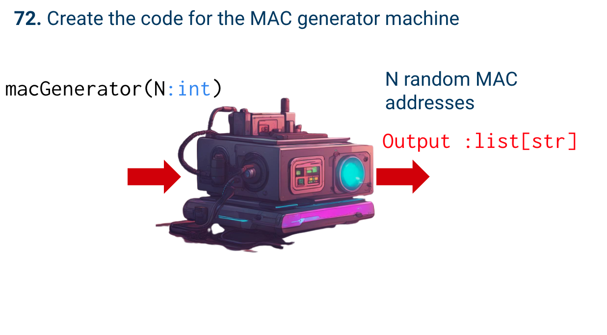
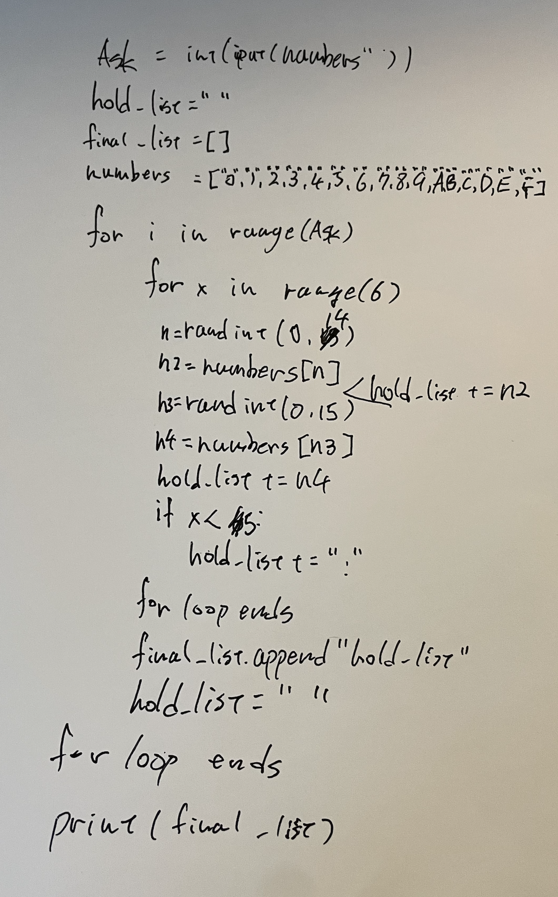
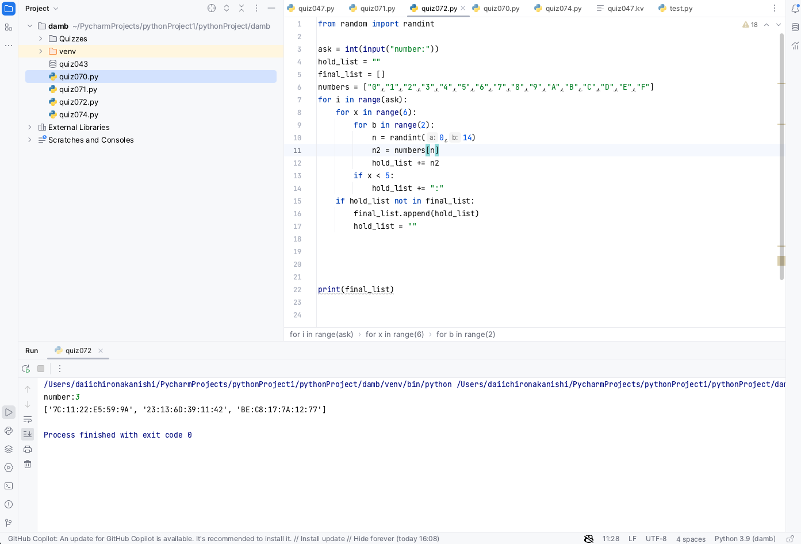

# Quiz 72

## Problem


## Paper work



## Code
```.py
from random import randint

ask = int(input("number:"))
hold_list = ""
final_list = []
numbers = ["0","1","2","3","4","5","6","7","8","9","A","B","C","D","E","F"]
for i in range(ask):
    for x in range(6):
        for b in range(2):
            n = randint(0,14)
            n2 = numbers[n]
            hold_list += n2
        if x < 5:
            hold_list += ":"
    if hold_list not in final_list:
        final_list.append(hold_list)
        hold_list = ""


print(final_list)

```


## Result



