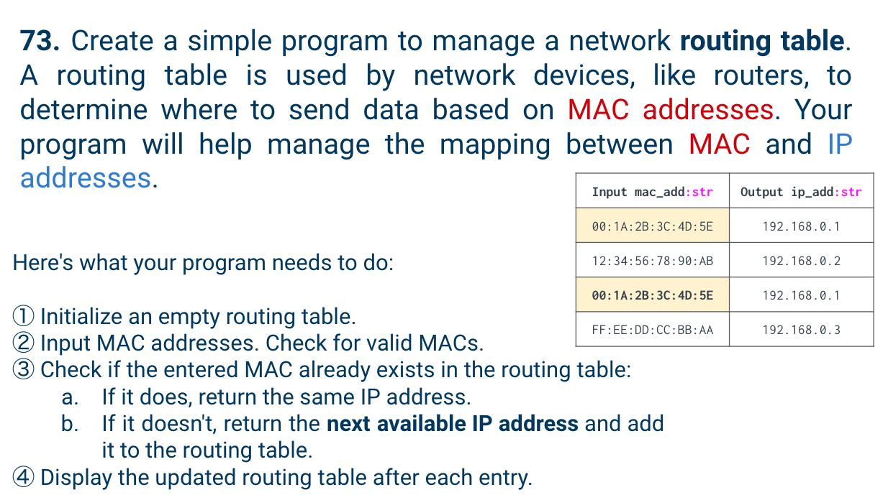
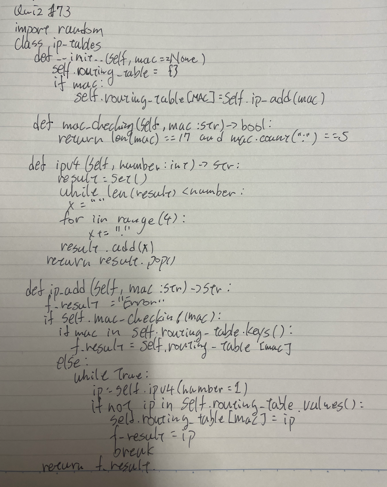
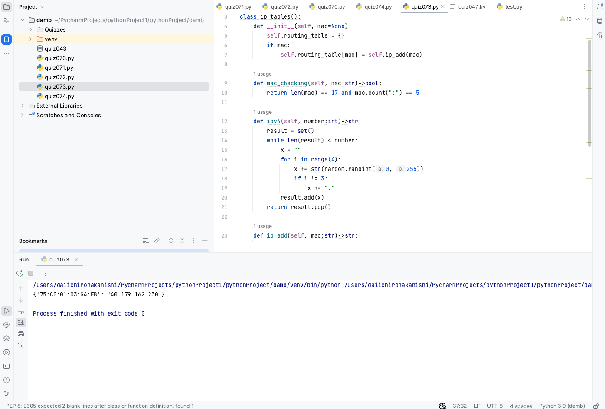

# Quiz 73

## Problem


## Paper work



## Code
```.py
import random

class ip_tables():
    def __init__(self, mac=None):
        self.routing_table = {}
        if mac:
            self.routing_table[mac] = self.ip_add(mac)

    def mac_checking(self, mac:str)->bool:
        return len(mac) == 17 and mac.count(":") == 5

    def ipv4(self, number:int)->str:
        result = set()
        while len(result) < number:
            x = ""
            for i in range(4):
                x += str(random.randint(0, 255))
                if i != 3:
                    x += "."
            result.add(x)
        return result.pop()

    def ip_add(self, mac:str)->str:
        f_result = "Error"
        if self.mac_checking(mac):
            if mac in self.routing_table.keys():
                f_result = self.routing_table[mac]
            else:
                while True:
                    ip = self.ipv4(number=1)
                    if not ip in self.routing_table.values():
                        self.routing_table[mac] = ip
                        f_result = ip
                        break
        return f_result

r = ip_tables("75:C0:01:03:G4:FB")
print(r.routing_table)

```

## Result


