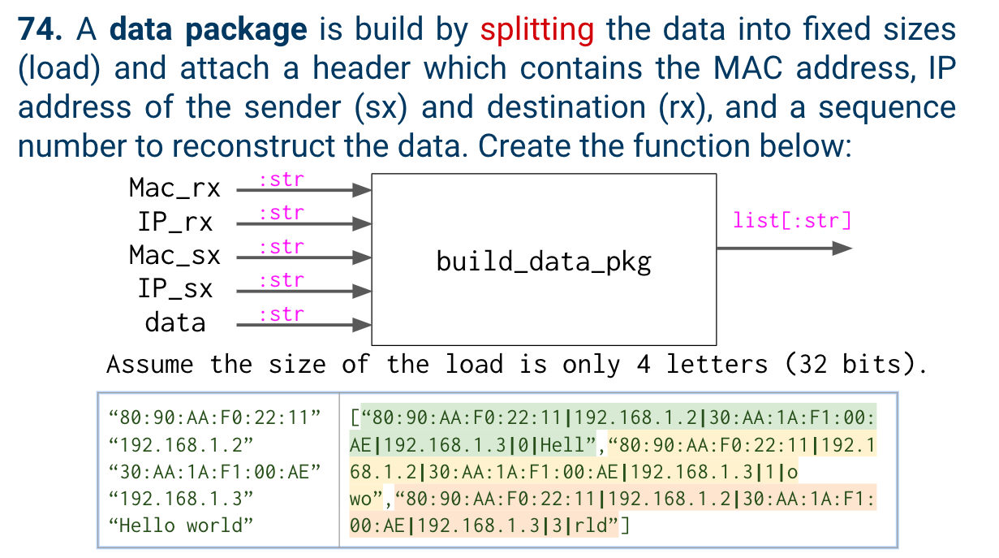
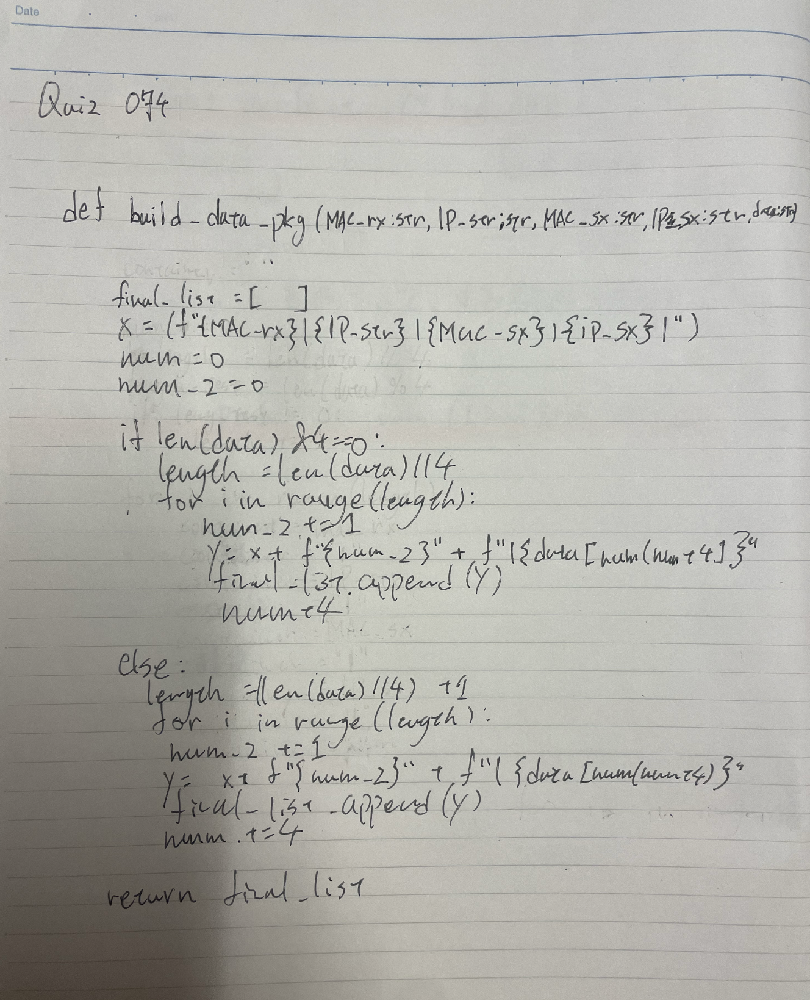
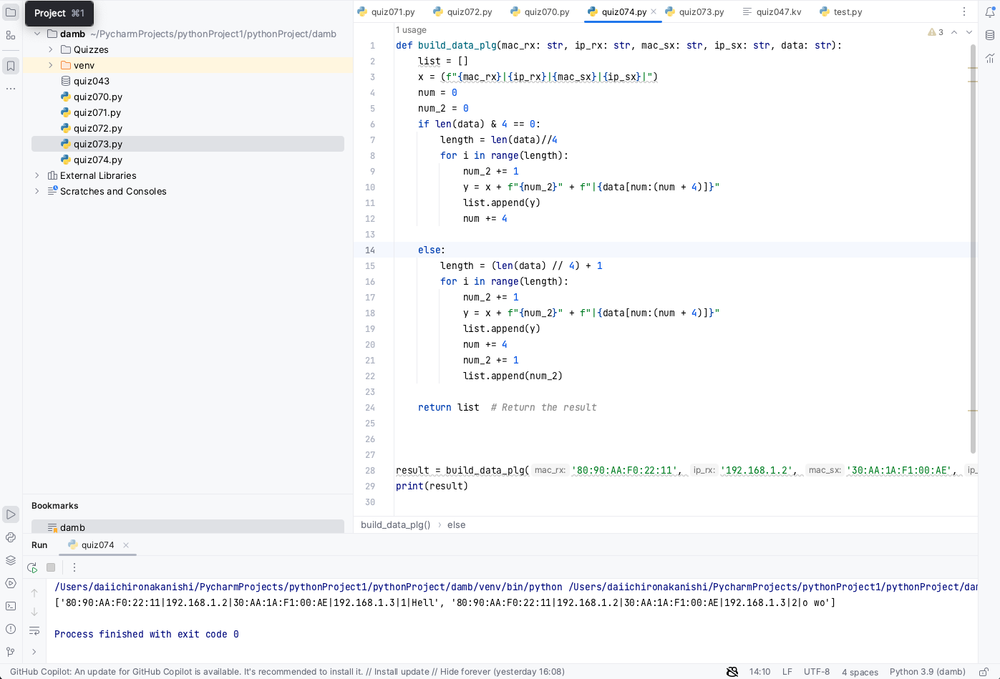

# Quiz 74

## Problem


## Paper work



## Code
```.py

def build_data_plg(mac_rx: str, ip_rx: str, mac_sx: str, ip_sx: str, data: str):
    list = []
    x = (f"{mac_rx}|{ip_rx}|{mac_sx}|{ip_sx}|")
    num = 0
    num_2 = 0
    if len(data) & 4 == 0:
        length = len(data)//4
        for i in range(length):
            num_2 += 1
            y = x + f"{num_2}" + f"|{data[num:(num + 4)]}"
            list.append(y)
            num += 4

    else:
        length = (len(data) // 4) + 1
        for i in range(length):
            num_2 += 1
            y = x + f"{num_2}" + f"|{data[num:(num + 4)]}"
            list.append(y)
            num += 4

    return list  # Return the result


result = build_data_plg('80:90:AA:F0:22:11', '192.168.1.2', '30:AA:1A:F1:00:AE', '192.168.1.3', 'Hello world')
print(result)


```

## Result


