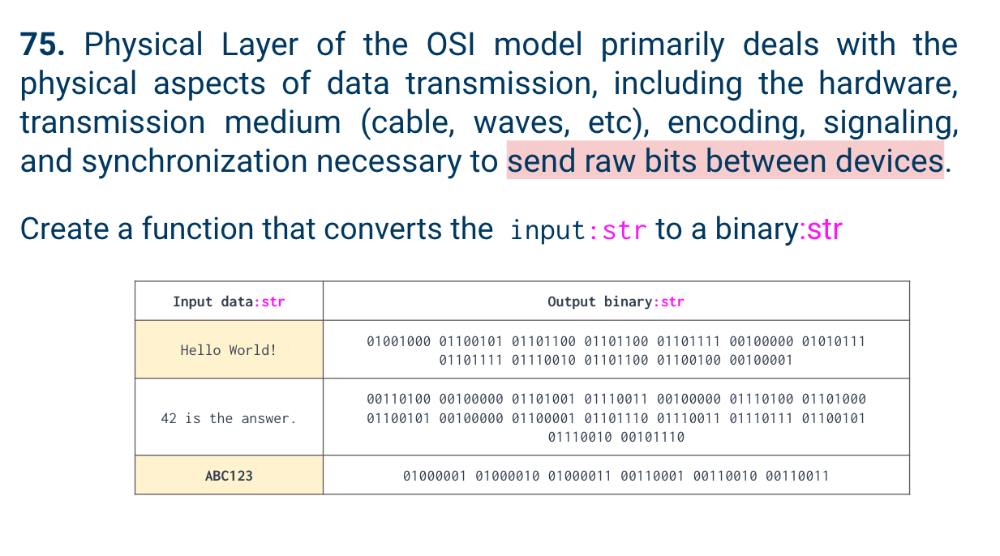
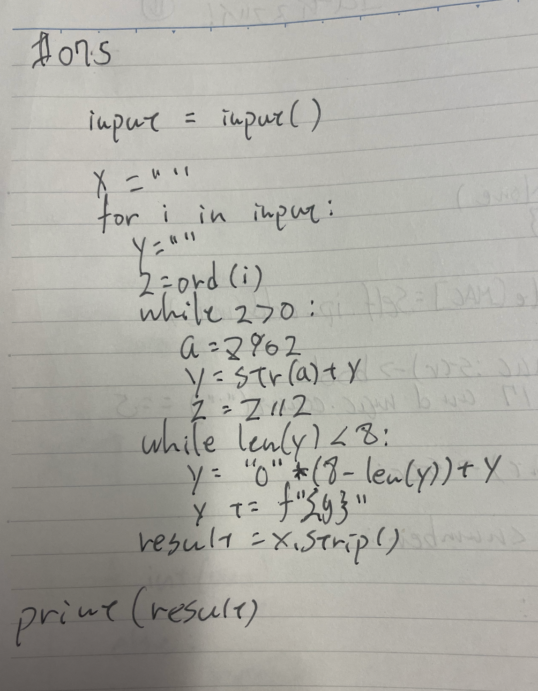
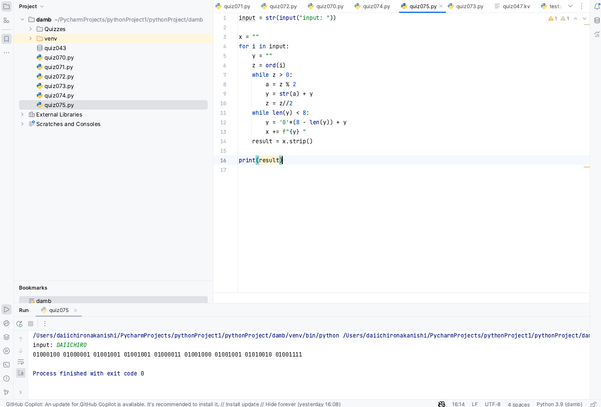

# Quiz 75

## Problem


## Paper work



## Code
```.py

input = str(input("input: "))

x = ""
for i in input:
    y = ""
    z = ord(i)
    while z > 0:
        a = z % 2
        y = str(a) + y
        z = z//2
    while len(y) < 8:
        y = '0'*(8 - len(y)) + y
        x += f"{y} "
    result = x.strip()

print(result)

```

## Result

