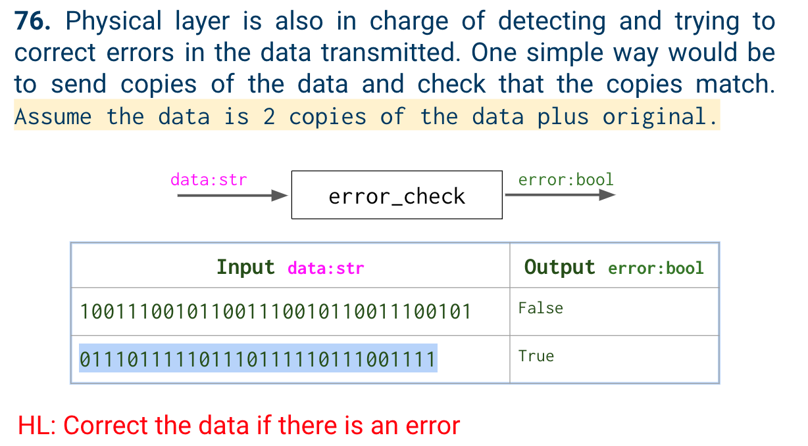
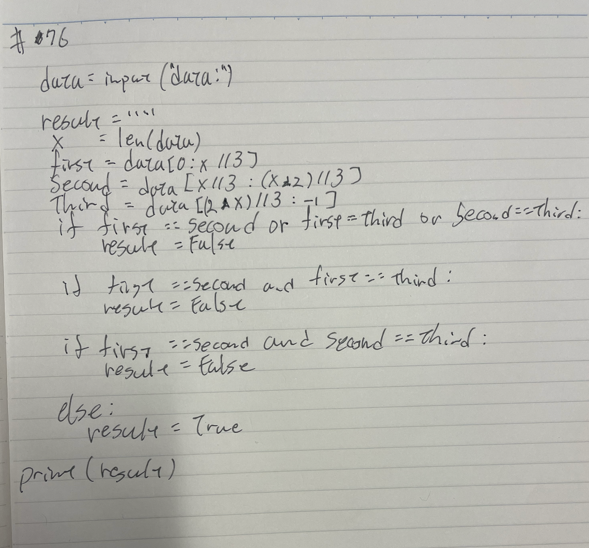
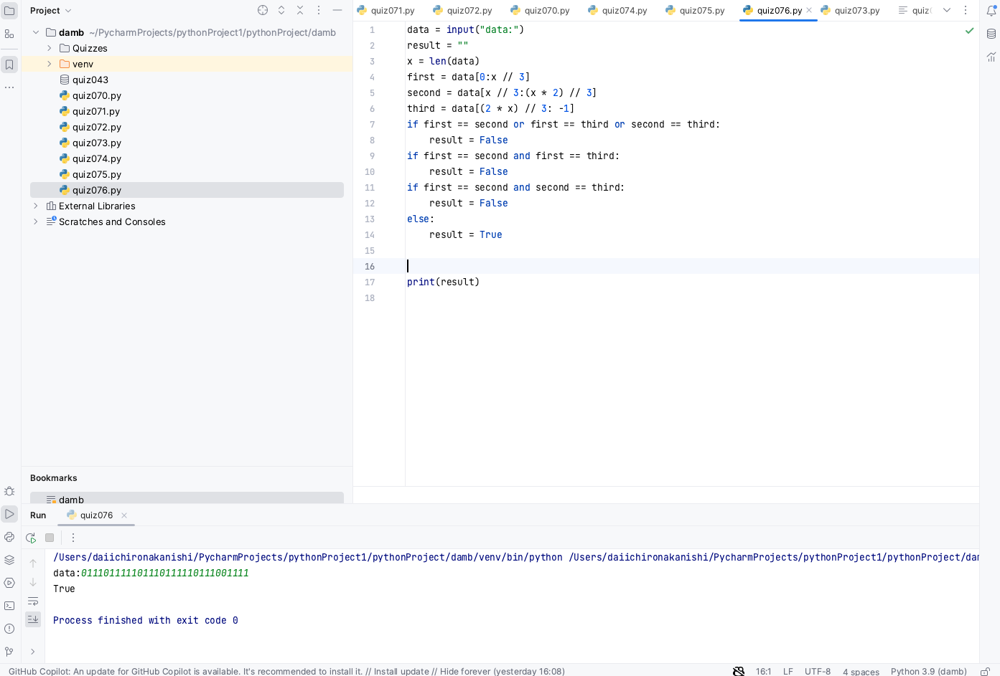

# Quiz 76

## Problem


## Paper work



## Code
```.py

data = input("data:")
result = ""
x = len(data)
first = data[0:x // 3]
second = data[x // 3:(x * 2) // 3]
third = data[(2 * x) // 3: -1]
if first == second or first == third or second == third:
    result = False
if first == second and first == third:
    result = False
if first == second and second == third:
    result = False
else:
    result = True


print(result)

```

## Result

