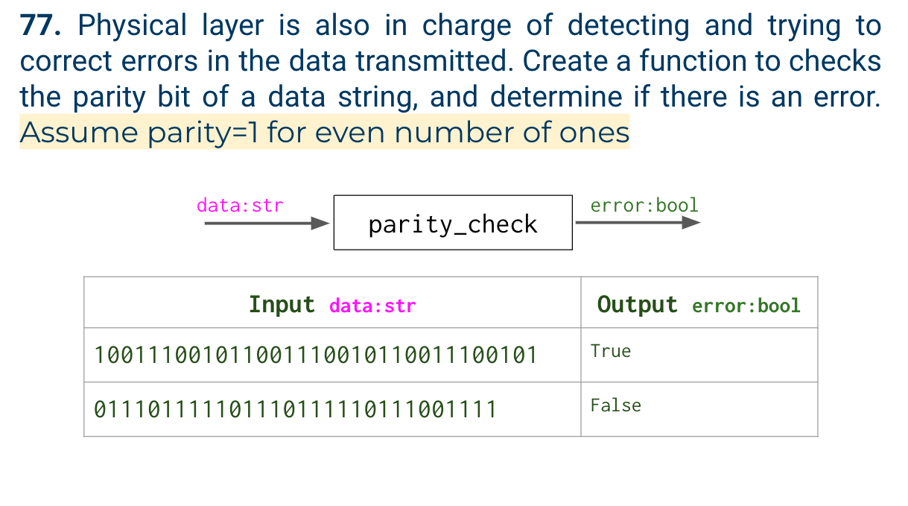

# Quiz 77

## Problem


## Paper work


## Code
```.py

data = input("Data: ")
error = False
x = int(data[0])
num = 0
for i in range(1, len(data)):
    num += int(data[i])

if num % 2 == 0 and x == 1:
    error = False

if num % 2 == 1 and x == 0:
    error = False

else:
    error = True

print(error)

```

## Result


