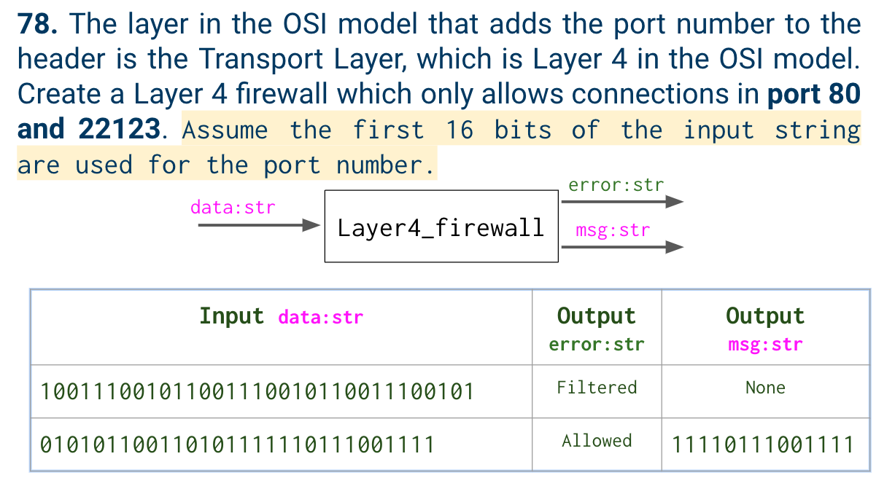
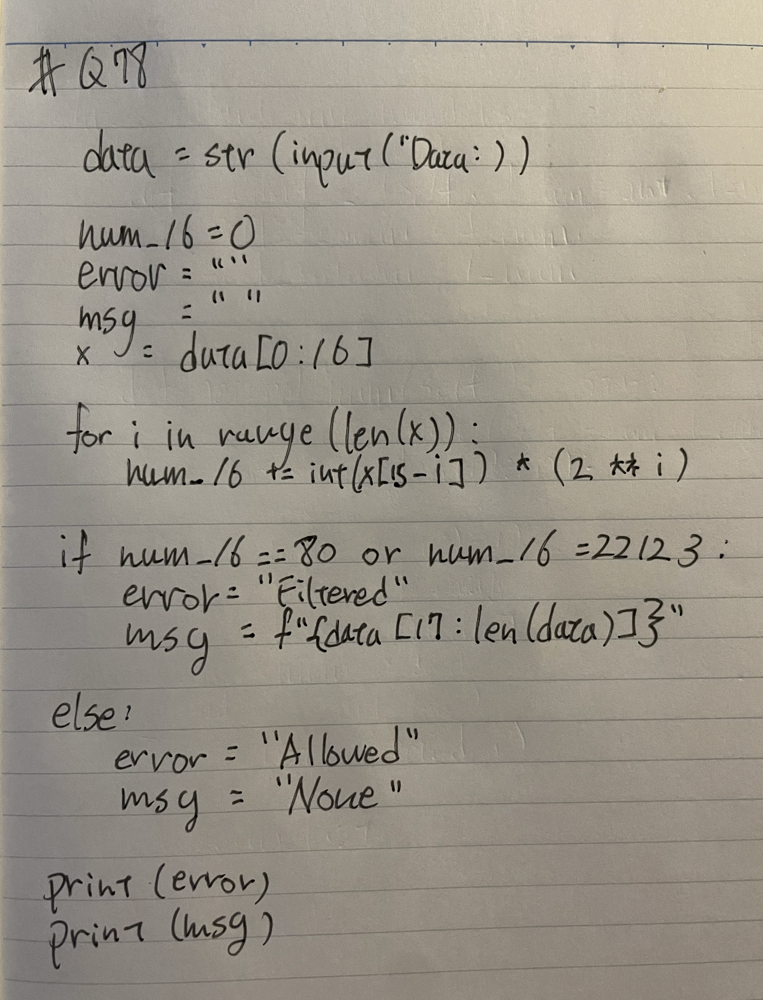
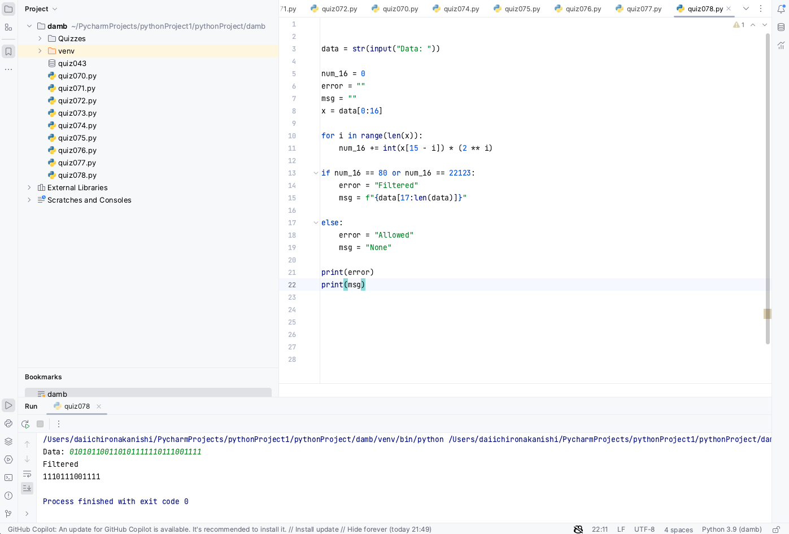

# Quiz 78

## Problem


## Paper work



## Code
```.py


data = str(input("Data: "))

num_16 = 0
error = ""
msg = ""
x = data[0:16]

for i in range(len(x)):
    num_16 += int(x[15 - i]) * (2 ** i)

if num_16 == 80 or num_16 == 22123:
    error = "Filtered"
    msg = f"{data[17:len(data)]}"

else:
    error = "Allowed"
    msg = "None"

print(error)
print(msg)


```

## Result

